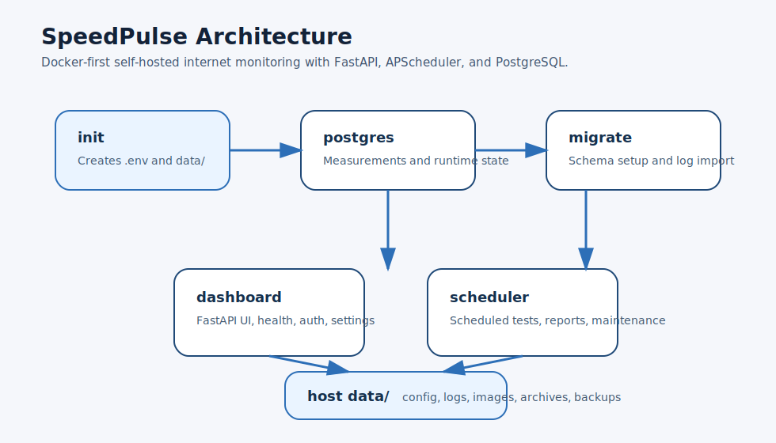

# SpeedPulse

[](LICENSE)
[](https://github.com/Sreniok/speedpulse/actions/workflows/ci.yml)
[](https://github.com/Sreniok/SpeedPulse/releases)
[](https://github.com/Sreniok/SpeedPulse/pkgs/container/speedpulse)
[](docker-compose.yml)
[](https://www.python.org)

SpeedPulse is a self-hosted internet monitoring tool with a FastAPI dashboard, scheduled speed tests, alerts, weekly/monthly reporting, encrypted backups, and a Docker-first deployment model.

It is designed as a strong portfolio project for Cloud / Platform / DevOps-style roles: containerized services, health semantics, CI quality gates, non-root runtime, and explicit data persistence.

## Who It Is For

- Self-hosters who want a small dashboard for internet quality monitoring
- People who want scheduled speed tests with history and reporting
- Recruiters, hiring managers, or engineers reviewing a Docker-first portfolio project

## What It Does Not Do

- It is not a multi-tenant SaaS product
- It is not a large-scale observability platform
- It does not include cloud-managed deployment templates by default
- It does not send email until SMTP is configured

## What It Does

- Runs scheduled speed tests with download, upload, ping, jitter, and packet loss
- Exposes a web dashboard for live status, history, charts, and settings
- Sends alerts and weekly/monthly reports
- Stores operational state in SQLite and measurement history in PostgreSQL
- Rotates archives and supports encrypted backup/restore

## Quick Start

### Option A: Pre-built image

```bash
mkdir speedpulse && cd speedpulse
curl -fsSL https://raw.githubusercontent.com/Sreniok/speedpulse/main/compose.deploy.yml -o docker-compose.yml
export SPEEDPULSE_IMAGE=ghcr.io/sreniok/speedpulse:v1.1.9
docker compose up -d
```

Skip `export SPEEDPULSE_IMAGE=...` if you want the latest published image instead of a pinned release tag.

### Option B: Build from source

```bash
git clone https://github.com/Sreniok/speedpulse.git
cd speedpulse
docker compose up -d --build
```

Open `http://localhost:8000`.

On first run an `init` container creates:

- `.env`
- `data/config.json`
- `data/Log/`
- `data/Images/`
- `data/Archive/`
- `data/Backups/`

The stack now also starts:

- `postgres`: measurement database
- `migrate`: schema + legacy log importer

If you cloned this repo locally, you can also use:

```bash
./quickstart.sh
```

## First-Time Setup

1. Open `http://localhost:8000`
2. Create an account from `/register` if no credentials are configured
3. Go to `Settings`
4. Configure thresholds, schedule, account details, and notifications
5. Set `SMTP_PASSWORD` in `.env` if you want email alerts/reports

## Demo

Suggested screenshots to add before broad public sharing:

- Login page
- Dashboard overview
- Historical charts
- Settings page

If you add images later, place them in a small `docs/` or `assets/` folder and link them from this section.

Architecture diagram:



## Architecture

```text
               +--------------------+
               +--------------------+
               |   init container   |
               | bootstrap .env and |
               | data/ on first run |
               +---------+----------+
                         |
                         v
               +--------------------+
               |     postgres       |
               | measurement store  |
               +---------+----------+
                         |
                         v
               +--------------------+
               |    migrate job     |
               | schema + log import|
               +----+-----------+---+
                    |           |
                    v           v
             +------+----+  +---+--------+
             | dashboard |  | scheduler  |
             | FastAPI   |  | APScheduler|
             | /health   |  | jobs       |
             | /ready    |  | speedtests |
             +-----------+  +------------+

Host `./data` keeps config, logs, images, archives, and encrypted backup artifacts.
PostgreSQL is the source of truth for measurements, notification history, and runtime/auth state.
```

## Data Persistence

Current persistence model is split by responsibility:

- `.env`: deployment secrets and runtime overrides
- `data/config.json`: application configuration
- PostgreSQL `speed_tests`: measurement source of truth
- PostgreSQL `notification_events`: notification history for the dashboard
- PostgreSQL runtime tables: auth/session/reset/manual-run state
- `data/Log/`: legacy log history and compatibility/backup trail
- `data/Images/`: generated charts/assets
- `data/Archive/`: archived logs and legacy compatibility files
- `data/Backups/`: encrypted backup artifacts

- Runtime application state now uses the shared SQL database (`state_store.py`)
- Historical measurements are now imported into PostgreSQL on startup via `db_migrate.py`
- Speed tests still write log files during the transition, so backups and recovery remain simple
- Backups include an encrypted SQL runtime-state snapshot for restore portability

## Security Model

- Containers run as non-root (`1000:1000`)
- `read_only: true`, `tmpfs: /tmp`, `cap_drop: ALL`
- `no-new-privileges:true`
- Session cookies support `Secure` auto-detection
- FastAPI adds CSP and standard browser security headers
- Secrets stay in `.env`, not in `config.json`
- Backups are encrypted before export

## Health Model

- `/health`: liveness endpoint
- `/ready`: readiness endpoint

Readiness validates:

- config file exists and loads
- storage paths are writable
- measurement database is reachable
- legacy state DB path is writable when fallback mode is used
- `speedtest` binary is available
- email configuration issues are surfaced as warnings

Docker healthchecks use `/ready`, not just a shallow HTTP 200.

## CI / Delivery

- `ci.yml` runs `ruff check`, `pytest`, and `mypy` on maintained typed modules on every push/PR
- `docker-publish.yml` now gates image publishing on the same quality checks
- Docker image uses Python 3.12 consistently across docs, tooling, and runtime
- Ookla CLI is version-pinned in the image build for reproducible builds

## Common Commands

```bash
docker compose up -d
docker compose down
docker compose logs -f
docker compose logs -f dashboard
docker compose logs -f scheduler
docker compose up -d --build
```

If you cloned this repo:

```bash
make up
make down
make logs
make password
```

## Troubleshooting

- If `docker compose up -d` fails on first run, run `make setup` and try again
- If `/ready` shows an email warning, set `SMTP_PASSWORD` in `.env` or configure it in Settings
- If the dashboard is not reachable, check `docker compose logs -f dashboard`
- If database startup is slow on first boot, wait for `postgres` and `migrate` to finish before retrying

## Upgrading

- Back up your `data/` directory and `.env` before changing versions
- Pull the new code or deployment file
- Rebuild and restart with `docker compose up -d --build`
- Check `http://localhost:8000/ready` after upgrade

## Releases

- Current release target: `v1.1.9`
- Changelog: [CHANGELOG.md](CHANGELOG.md)
- Release draft: [RELEASE_NOTES_v1.1.9.md](RELEASE_NOTES_v1.1.9.md)
- Short GitHub release body: [RELEASE_DESCRIPTION_v1.1.9.md](RELEASE_DESCRIPTION_v1.1.9.md)

## Important Files

- `.env`: auth, secrets, SMTP password, deployment overrides
- `data/config.json`: dashboard, thresholds, schedules, notification config
- `data/Log/`: speed test history
- `data/Images/`: generated chart images
- `state_store.py`: runtime/auth/session state storage layer
- `docker-compose.yml`: source deployment
- `compose.deploy.yml`: pre-built image deployment
- `.github/workflows/ci.yml`: test/lint/type-check pipeline

## Manual Commands

```bash
python3 CheckSpeed.py
python3 SendWeeklyReport.py
python3 SendMonthlyReport.py
python3 health_check.py
python3 rotate_logs.py
```

## Roadmap

- `v1.2.x`: split `web/app.py` into smaller route/service/storage modules
- `v1.3.x`: improve migrations and backup/restore ergonomics as schema complexity grows
- `v1.4.x`: add structured metrics and broader deployment targets such as Kubernetes or Helm

## License

MIT. See [LICENSE](LICENSE).
